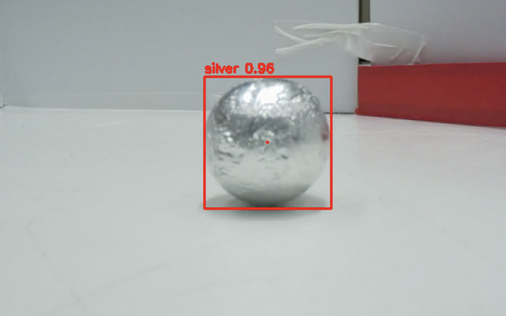

# 15/06/2026 - 21/06/2026

### What I worked on:
I updated the photo-taking script to take photos at a constant fps, to have a wider variety of images including some that are blurred or distorted slightly. I changed the resolution that I use to 1536x864, which should be good for performance whilst not cropping the image as it is still 16:9 ratio. I then worked on getting the video stream working in ros, and added a launch script to only run my nodes for testing of inference. I moved the movement handling code into the main rescue script, just for readability. I then merged my state machine into the main rescue script, as it would be better logic wise to do it this way. I then added another custom service so that the rescue script can tell the vision script when to start and stop, and further fleshed out the vision script. I then used the library vision_msgs to format the inference data into a format that I can send back to the main rescue script, as an array of Detection2D objects. I finally got inference working within ros, with many hours spent debugging errors and testing the basic version of my model.

### Reflection
The longest part this week was getting inference working within ros, due to the custom camera interface where I have to subscribe to a camera topic instead of simply doing picam2.capture_array() or similar. In addition to this, I had to redo how inference was handled, due to having to use a timer to run inference at a set fps within ros.

### Decisions made
I decided to use the resolution 1536x864 to have decent resolution and clarity without having massive images. At that resolution, there are 1.3million pixels per image.
I decided to use a topic to publish inference data to the main rescue node, using the vision_msgs library and its formatting. I could have used a list or dictionary, but the Detection2DArray was exactly what I needed and made that step simpler.

### Testing notes
Inference is now working in ros, and outputs to a .mp4 file with detected balls annotated with a red circle, there is a red dot on the calculated centre of the ball and text displaying the confidence of the model.

### AI log use
Some AI (ChatGPT/Google AI) used for debugging errors experienced during testing and programming of inference handling code.
